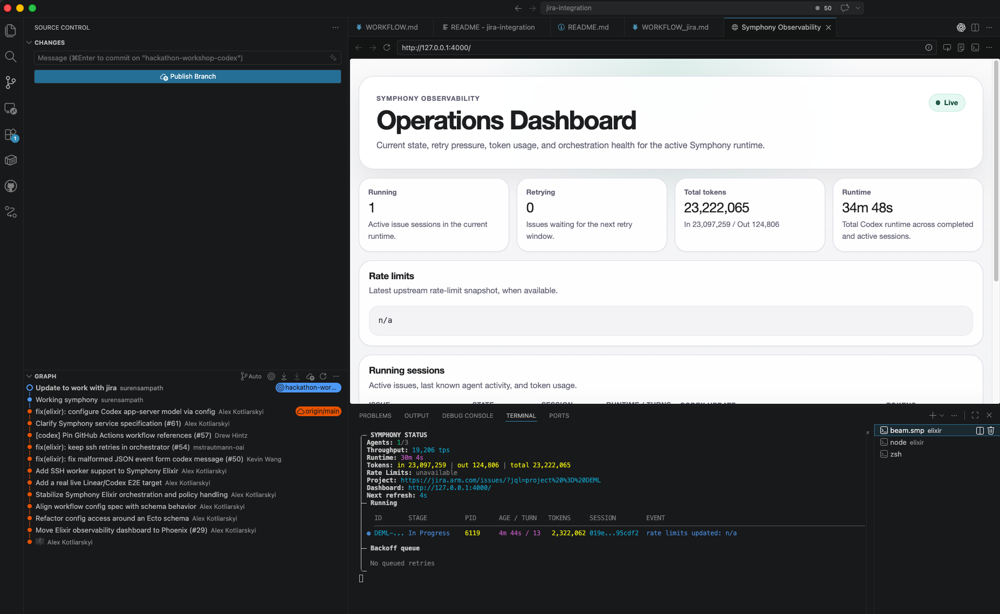

# Symphony

Symphony turns project work into isolated, autonomous implementation runs, allowing teams to manage
work instead of supervising coding agents.

## JIRA Integration

This Symphony instance is configured to use JIRA as the project tracker. The workflow is set up to pick up tickets that are in the "In Progress" state and assigned to Suren Sampath.

To adjust JIRA settings, edit the `elixir/WORKFLOW_jira.md` file.

[See workflow example](elixir/WORKFLOW_jira.md)

_Screenshot: Symphony in action, managing tickets and agent runs._

---

Credit: This project is based on [openai/symphony](https://github.com/openai/symphony).

> [!WARNING]
> Symphony is a low-key engineering preview for testing in trusted environments.

## Running Symphony

### Requirements

Symphony works best in codebases that have adopted
[harness engineering](https://openai.com/index/harness-engineering/). Symphony is the next step --
moving from managing coding agents to managing work that needs to get done.

### Option 1. Make your own

Tell your favorite coding agent to build Symphony in a programming language of your choice:

> Implement Symphony according to the following spec:
> https://github.com/openai/symphony/blob/main/SPEC.md

### Option 2. Use our experimental reference implementation

Check out [elixir/README.md](elixir/README.md) for instructions on how to set up your environment
and run the Elixir-based Symphony implementation. You can also ask your favorite coding agent to
help with the setup:

> Set up Symphony for my repository based on
> https://github.com/openai/symphony/blob/main/elixir/README.md

---

## License

This project is licensed under the [Apache License 2.0](LICENSE).

